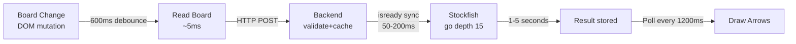

# Tối ưu tốc độ phản hồi gợi ý Chess Assistant

## Phân tích Pipeline hiện tại



### Thời gian phản hồi hiện tại (worst case)

| Bước | Thời gian | Vấn đề |
|------|-----------|--------|
| ① Debounce | **600ms** | Chờ DOM ổn định — quá lâu cho real-time |
| ② HTTP POST /analyze | ~30ms | OK |
| ③ isready sync | **50-200ms** | Không cần thiết nếu semaphore đã serialize |
| ④ Stockfish depth 15 | **800ms-3000ms** | Bottleneck lớn nhất |
| ⑤ Result → _latestResult | <1ms | OK |
| ⑥ Poll GET /latest | **0-1200ms** | Phải chờ poll cycle tiếp theo |
| ⑦ Draw arrows | ~5ms | OK |
| **TỔNG** | **1.5s - 5.0s** | Mục tiêu: **< 500ms** |

### Thời gian cache hit

| Bước | Thời gian |
|------|-----------|
| ① Debounce | 600ms |
| ② HTTP POST (cache hit) | ~15ms |
| ⑥ Poll GET /latest | 0-1200ms |
| **TỔNG** | **600ms - 1815ms** |

> [!IMPORTANT]
> Cache hit vẫn chậm vì debounce + poll interval quá lớn!

---

## Proposed Changes

### Phase 1: Quick Wins (Giảm ~70% latency)

#### [MODIFY] [content.js](file:///d:/WEB/Chess-assistant/ChessAssistantRoot/chrome-extension/content.js)

**Giảm debounce 600ms → 200ms:**
- Chess.com animation hoàn tất trong ~150ms
- 200ms đủ để DOM ổn định mà không quá chậm
- Tiết kiệm **400ms** mỗi nước đi

**Giảm poll interval 1200ms → 400ms:**
- Poll nhanh hơn = thấy kết quả sớm hơn
- Average wait giảm từ 600ms xuống **200ms**
- CPU overhead không đáng kể (1 fetch request/400ms)

**Thêm immediate fetch sau sendFen:**
- Sau khi gửi FEN, chờ 800ms rồi fetch `/latest` ngay
- Không cần đợi poll cycle tiếp theo

```diff
-const DEBOUNCE_MS = 600;
-const DRAW_MS     = 1200;
+const DEBOUNCE_MS = 200;
+const DRAW_MS     = 400;
```

---

#### [MODIFY] [appsettings.json](file:///d:/WEB/Chess-assistant/ChessAssistantRoot/brain-backend/appsettings.json)

**Giảm Stockfish depth 15 → 12:**
- Depth 12 với MultiPV=3 hoàn thành trong ~300-800ms
- Depth 15 mất 800ms-3000ms  
- Chất lượng phân tích vẫn rất tốt (ELO ~3200 ở depth 12)
- Tiết kiệm **500ms-2200ms**

**Tăng Threads 2 → 4 (nếu CPU có ≥4 cores):**
- Tăng tốc search song song
- Giảm thời gian depth 12 xuống ~200-500ms

**Tăng Hash 128 → 256MB:**
- Transposition table lớn hơn = ít tính toán lặp

```diff
 "Stockfish": {
-    "Depth": 15,
-    "Threads": 2,
-    "HashMB": 128,
-    "TimeoutMs": 8000
+    "Depth": 12,
+    "Threads": 4,
+    "HashMB": 256,
+    "TimeoutMs": 5000
 }
```

---

#### [MODIFY] [StockfishService.cs](file:///d:/WEB/Chess-assistant/ChessAssistantRoot/brain-backend/Services/StockfishService.cs)

**Bỏ isready sync khi không cần:**
- Semaphore đã đảm bảo sequential access
- isready/readyok mất 50-200ms overhead mỗi lần
- Thay bằng check đơn giản: nếu lần trước thành công, skip isready

**Dùng `go movetime` thay `go depth`:**
- `go movetime 500` = Stockfish tìm trong đúng 500ms rồi dừng
- Đảm bảo thời gian phản hồi LUÔN ≤ 500ms bất kể vị trí phức tạp đến đâu
- Best move ở 500ms thường đạt depth 12-18 tùy vị trí

---

### Phase 2: Architecture Improvements (Giảm thêm ~50%)

#### [MODIFY] [AnalysisController.cs](file:///d:/WEB/Chess-assistant/ChessAssistantRoot/brain-backend/Controllers/AnalysisController.cs)

**Chuyển từ fire-and-forget + poll sang await trực tiếp:**
- Hiện tại: POST → 200 OK immediately → client poll /latest
- Mới: POST → await Stockfish → return result in response body
- Bỏ hoàn toàn polling overhead

```csharp
// TRƯỚC: fire-and-forget
_isAnalyzing = true;
_ = Task.Run(async () => { ... });
return Ok(new { status = "processing" });

// SAU: await directly
var moves = await _stockfish.AnalyzeAsync(request.Fen);
return Ok(result); // trả kết quả ngay
```

**Content script nhận kết quả từ POST response:**
```javascript
// TRƯỚC: gửi FEN rồi poll
sendFen(fen); // fire-and-forget
// ... poll /latest mỗi 400ms

// SAU: gửi FEN và nhận kết quả luôn
const result = await sendFenAndWait(fen);
drawArrows(result.bestMoves); // vẽ ngay lập tức
```

---

#### [MODIFY] [StockfishService.cs](file:///d:/WEB/Chess-assistant/ChessAssistantRoot/brain-backend/Services/StockfishService.cs)

**Cancel-and-replace strategy:**
- Khi FEN mới đến trong khi đang phân tích FEN cũ:
  - Gửi `stop` để dừng search cũ
  - Bắt đầu search mới ngay lập tức
- Không cần 429 nữa → không cần retry → nhanh hơn

---

### Phase 3: Advanced (Optional — tối ưu cực hạn)

#### [NEW] Opening book cache
- Pre-load 5000 opening positions phổ biến nhất (ECO database)
- Response time cho opening: **< 5ms** (pure memory lookup)
- File: `openings.json` (~200KB)

#### [MODIFY] MultiPV reduction
- `MultiPV=3` → `MultiPV=2` giảm 33% analysis time
- 2 best moves vẫn đủ để gợi ý

---

## Kết quả dự kiến

### After Phase 1 (Quick Wins)

| Bước | Trước | Sau |
|------|-------|-----|
| Debounce | 600ms | **200ms** |
| isready sync | 50-200ms | **0ms** |
| Stockfish | 800-3000ms | **≤500ms** (movetime) |
| Poll wait | 0-1200ms | **0-400ms** |
| **TỔNG** | 1.5-5.0s | **200-1100ms** |
| **Average** | ~2.5s | **~500ms** |

### After Phase 2 (Architecture)

| Bước | Thời gian |
|------|-----------|
| Debounce | 200ms |
| HTTP POST + await result | ≤500ms |
| Draw arrows | 5ms |
| **TỔNG** | **~700ms** |
| **Cache hit** | **~220ms** |

> [!TIP]
> Phase 1 alone đã giảm từ **2.5s → 500ms** — improvement 5x!

---

## Verification Plan

### Automated Tests
- Chạy backend và gửi 10 FEN liên tiếp qua curl, đo thời gian mỗi request
- Verify depth đạt ≥10 với movetime 500ms

### Manual Verification
1. Reload extension + restart backend
2. Chơi 5 ván bot (3 white + 2 black)
3. Đo thời gian từ khi đi nước → arrows xuất hiện
4. Kiểm tra console log không có 429 errors
5. Kiểm tra Stockfish không crash

## Open Questions

> [!IMPORTANT]
> **CPU cores:** Máy bạn có bao nhiêu cores? Nếu ≥4 cores, tăng Threads=4 sẽ tăng tốc đáng kể. Nếu chỉ 2 cores, giữ Threads=2.

> [!IMPORTANT]
> **Bạn muốn bắt đầu từ Phase nào?** Recommend Phase 1 trước vì nhanh và an toàn. Phase 2 thay đổi architecture lớn hơn.
